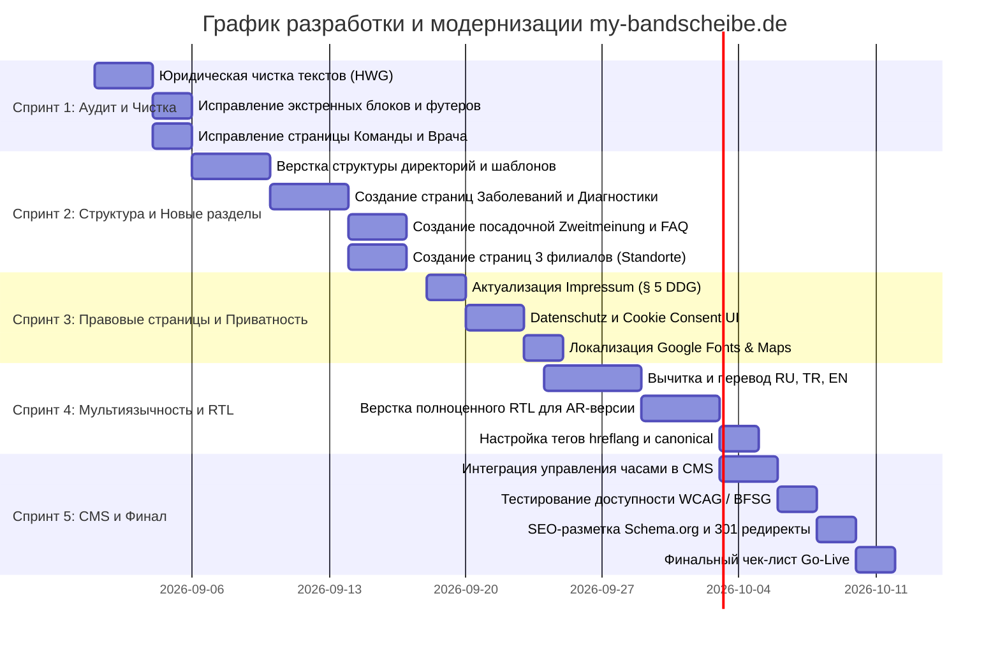

# ПЛАН РАЗРАБОТКИ И МОДЕРНИЗАЦИИ САЙТА MY-BANDSCHEIBE.DE
**Основан на Master-Dokument от 29.08.2026 и аудите текущей кодовой базы**

---

## 1. Паспорт проекта и концептуальные требования

* **Проект:** Официальный сайт частной нейрохирургической практики `my-bandscheibe.de`
* **Врач / Руководитель:** Dr. med. Kasim Fischer-Rahimov
* **Специализация:** Facharztpraxis für Neurochirurgie und Wirbelsäulenerkrankungen (нейрохирургия, хирургия позвоночника, периферические нервы, интервенционная противоболевая терапия)
* **Филиалы (3 локации):** Viersen, Mönchengladbach, Düsseldorf
* **Языковые версии:** Базовые (DE, RU, TR, AR с поддержкой RTL), перспективные (EN, UZ)
* **Нормативно-правовая база Германии:**
  * **§ 5 DDG** (Digitale-Dienste-Gesetz — заменил § 5 TMG) — требования к Impressum
  * **§ 3 HWG** (Heilmittelwerbegesetz) — строгий запрет на вводящую в заблуждение рекламу, суперлативы и обещания исцеления/успеха
  * **§ 27 Berufsordnung Ärztekammer Nordrhein** — профессионально-этические правила для врачебных сайтов
  * **Art. 9 DSGVO & § 25 TDDDG** — защита особых категорий персональных данных (Gesundheitsdaten) и управление cookie/consent
  * **BFSG / WCAG 2.1 AA** — доступность интерфейсов (Barrierefreiheit)

---

## 2. Глубокий аудит текущего состояния: «Что сделано» vs «Что требуется по ТЗ»

| Направление | Текущее состояние в коде | Требования ТЗ (Master-Dokument) | Статус / Вердикт |
| :--- | :--- | :--- | :--- |
| **Архитектура и Sitemap** | 6 плоских файлов: `index`, `behandlungen`, `praxis-schwerpunkte`, `unser-team`, `presseschau`, `sprechzeiten` | Иерархическая структура из 20+ страниц: `/praxis/`, `/erkrankungen/`, `/diagnostik/`, `/behandlungen/`, `/zweitmeinung/`, `/standorte/`, `/patienteninformationen/` | 🔴 **Требуется полная реструктуризация** |
| **Главная страница (`index.html`)** | Содержит рекламные слоганы: `1,200+ Erfolgreiche Behandlungen`, `98% Patientenzufriedenheit`, нет явного блока врача и 3 филиалов | Строгий запрет суперлативов (§ 3 HWG); блоки: Hero, Направления, Dr. med. Kasim Fischer-Rahimov, 3 филиала, CTA, экстренные службы (112, 116117) | 🔴 **Критическая переработка по HWG** |
| **Команда и врач (`unser-team.html`)** | Биография доктора Фишера ошибочно подписана именем Nese Kirak; Dr. Fischer помещен в рядовые карточки; используются стоковые фото | Четкое разделение: `Ärztliche Leitung` (Dr. med. Kasim Fischer-Rahimov) и `Praxisteam`. Только реальные сотрудники с подтвержденными ролями. Запрет AI-людей | 🔴 **Критическая ошибка контента** |
| **Филиалы (Standorte)** | В контактах указан только один адрес (Mönchengladbach, Viersener Str. 50) | 3 полноценных филиала: **Viersen** (Theodor-Heuss-Platz 10), **Mönchengladbach** (Bismarckstr. 106), **Düsseldorf** (Schadowstr. 74) | 🔴 **Не соответствуют адреса и количество** |
| **Второе мнение (`/zweitmeinung/`)** | Отсутствует как выделенный сценарий | Выделенный пошаговый процесс: Документы $\rightarrow$ Консультация $\rightarrow$ Независимая оценка $\rightarrow$ Варианты лечения | 🟡 **Нужно разработать с нуля** |
| **Диагностика (`/diagnostik/`)** | Смешана в общем списке услуг | Выделенный раздел: Нейрофизиология (EMG, ENG/NLG, SEP) + Анализ МРТ/КТ/Рентген + сотрудничество с радиологией | 🟡 **Нужно разработать с нуля** |
| **Заболевания (`/erkrankungen/`)** | Ограниченный список в общих блоках | Четкая группировка: 1) Позвоночник, 2) Периферические нервы, 3) Болевые синдромы | 🟡 **Нужно разработать с нуля** |
| **Информация пациентам** | Отсутствует | Памятка: подготовка к визиту, инструкции до/после операции, Nachsorge/Reha, FAQ | 🟡 **Нужно разработать с нуля** |
| **Правовые страницы (Impressum / Datenschutz)** | Устаревшие ссылки на TMG/ODR, нет детального описания стека | `Impressum` по § 5 DDG (Nordrhein); `Datenschutz` под реальный tech stack (Doctolib, Maps Consent, локальные шрифты) | 🔴 **Юридическое несоответствие** |
| **Мультиязычность** | Папки `ru`, `tr`, `ar`, `en` содержат машинный автоперевод (*«Контакт нас»*, *«Наше лечение методы»*); AR без полноценного RTL | Высококачественный медицинский перевод после финализации DE; полноценная поддержка RTL для арабского языка; hreflang теги | 🔴 **Требуется редактирование и верстка RTL** |
| **Безопасность данных (DSGVO Art. 9)** | Контактная форма в `sprechzeiten.html` без шифрованного хранилища | Запрет сбора медицинских файлов (MRT/CT, Arztbrief) через открытые незащищенные формы | 🟡 **Требуется защищенный шлюз / регламент** |
| **Экстренные контакты (Notfall)** | Написано `24/7 Notfall: (02161)...` с номером практики | Нейтральная формулировка: 112 (Notruf) и 116117 (Terminservice/Bereitschaftsdienst) без обещания дежурства практики | 🔴 **Критический риск** |
| **CMS / Панель управления** | Базовый скрипт `sync_cms.py` + Firebase для статических полей | CMS для быстрого редактирования часов работы, контактов и экстренных оповещений о временном закрытии филиалов | 🟢 **Есть база, нужно расширить** |

---

## 3. БЛОКИРУЮЩИЙ СПИСОК: «Категорически запрещено публиковать до устранения»

Согласно разделу 19 ТЗ, сайт **НЕЛЬЗЯ** публиковать со следующими элементами:
1. ❌ **Placeholder-данные:** номера вида `0211-xxxx / xxxxx` (Дюссельдорф).
2. ❌ **Внутренние номера Praxiszentrale:** номера для служебной связи между практиками должны иметь статус `INTERN – NICHT VERÖFFENTLICHEN`.
3. ❌ **Неподтвержденные титулы и звания:** называть «Wirbelsäulenmedizin» официальным титулом врача, если его нет в документах Ärztekammer; указывать неподтвержденные Zusatzbezeichnungen.
4. ❌ **AI-персонал:** генеративные лица, выдаваемые за реальных сотрудников клиники.
5. ❌ **Суперлативы и гарантии (§ 3 HWG):** фразы «лучший», «самый современный», «гарантия избавления от боли», «100% успех».
6. ❌ **Незащищенная загрузка медданных:** прием файлов МРТ/КТ через обычные PHP/JS-формы без договора поручения обработки данных (AVV) и шифрования.
7. ❌ **Устаревшие правовые ссылки:** ссылки на § 5 TMG, директиву RStV или закрытую платформу европейского досудебного урегулирования (EU-ODR).

---

## 4. Чек-лист запросов к заказчику (Что необходимо получить/утвердить)

*Для передачи клиенту перед финализацией текстов и верстки:*

- [ ] **Врач и квалификация:**
  - [ ] Официальная врачебная специальность (*Facharztbezeichnung*) по документам.
  - [ ] Подтвержденные дополнительные квалификации (*Zusatzbezeichnungen*), например: *Schmerztherapie*, *Spezielle Neurochirurgie* и т.д.
  - [ ] Список реальных членств в обществах (DGNC, DWG, BDNC, BDNR) для публикации логотипов.
  - [ ] Список научных публикаций (для раздела науки).
  - [ ] Актуальная профессиональная фотосессия доктора.
- [ ] **Команда практики:**
  - [ ] Актуальный поименный список сотрудников с их точными должностями.
  - [ ] Подписанные согласия сотрудников на публикацию их фото/имен на сайте (DSGVO).
- [ ] **Филиалы (Standorte):**
  - [ ] Подтверждение адреса и публичного телефона для филиала в **Viersen** (Theodor-Heuss-Platz 10, 4. OG).
  - [ ] Подтверждение адреса и публичного телефона для филиала в **Mönchengladbach** (Bismarckstr. 106, 3. OG).
  - [ ] Статус готовности филиала в **Düsseldorf** (Schadowstraße 74): открыт ли филиал, какой точный номер телефона и часы работы? Либо скрыть до официального открытия.
  - [ ] График работы каждого филиала по дням недели.
- [ ] **Медицинские услуги и оборудование:**
  - [ ] Подтверждение фактически проводимых операций из списка ТЗ (микрохирургия, эндоскопия, протезирование, кифопластика, стимуляция спинного мозга и т.д.).
  - [ ] Уточнение: проводятся ли операции в собственной амбулаторной операционной (OP-Bereich) или на базе клиник-партнеров (Belegbetten/Kooperationskliniken).
- [ ] **Технические интеграции:**
  - [ ] Подтверждение ссылки на онлайн-запись (Doctolib / Jameda).
  - [ ] Векторный логотип клиники (SVG или качественный PNG).
  - [ ] Решение по передаче снимков: через внешние защищенные DICOM/Cloud порталы или только очно на диске.

---

## 5. Целевая информационная архитектура (Новый Sitemap)

```
my-bandscheibe.de/
├── index.html                           # Главная (навигация по симптомам, врач, филиалы, CTA)
│
├── praxis/
│   ├── ueber-uns.html                   # О клинике, философии и подходах
│   ├── dr-fischer-rahimov.html          # Профиль главврача, опыт, специализация
│   └── team.html                        # Praxisteam, ассистенты, координаторы
│
├── erkrankungen/                        # Раздел: Заболевания
│   ├── index.html                       # Обзорный хаб заболеваний
│   ├── wirbelsaeule.html                # Заболевания позвоночника
│   ├── bandscheibenvorfall.html         # Межпозвоночная грыжа (шейный/поясничный отделы)
│   ├── spinalkanalstenose.html          # Стеноз спинномозгового канала
│   ├── karpaltunnelsyndrom.html         # Синдром карпального канала
│   ├── sulcus-ulnaris-syndrom.html      # Синдром локтевого нерва
│   └── schmerzsyndrome.html             # Хронические и послеоперационные болевые синдромы
│
├── diagnostik/                          # Раздел: Диагностика
│   ├── index.html                       # Обзор диагностических возможностей
│   ├── emg-eng-nlg.html                 # Электромиография и нейрография (EMG/ENG/NLG)
│   ├── sep.html                         # Соматосенсорные вызванные потенциалы (SEP)
│   └── bildgebung.html                  # Экспертиза MRT/CT/Röntgen (радиология)
│
├── behandlungen/                        # Раздел: Лечение и методы
│   ├── index.html                       # Обзор консервативных и оперативных методов
│   ├── wirbelsaeulenchirurgie.html      # Микрохирургия и эндоскопия позвоночника
│   ├── periphere-nerven.html            # Хирургия периферических нервов
│   ├── schmerztherapie.html             # Интервенционная противоболевая терапия
│   └── minimalinvasive-verfahren.html   # Малоинвазивные методики
│
├── zweitmeinung.html                    # Второе врачебное мнение (Zweitmeinung)
├── patienteninformationen.html          # Пациентам: чек-лист, памятки до/после OP, FAQ
│
├── standorte/                           # Раздел: Филиалы
│   ├── index.html                       # Все филиалы на карте
│   ├── viersen.html                     # Филиал Viersen (контакты, карта, парковка, ÖPNV)
│   ├── moenchengladbach.html            # Филиал Mönchengladbach
│   └── duesseldorf.html                 # Филиал Düsseldorf (после подтверждения)
│
├── wissenschaft-publikationen.html      # Научные работы и публикации
├── presseschau.html                     # Пресса и статьи
├── mitgliedschaften.html                # Членство в профессиональных ассоциациях (DGNC, DWG)
├── kontakt.html                         # Контакты, выбор филиала, Doctolib, форма
├── impressum.html                       # Правовая информация (§ 5 DDG, Ärztekammer Nordrhein)
├── datenschutz.html                     # Политика конфиденциальности (DSGVO)
└── 404.html                             # Страница ошибки с поиском и навигацией
```

---

## 6. Корректировка медицинских формулировок по нормам Германии (§ 3 HWG)

| Исходная рискованная формулировка | Причина риска | Одобренная безопасная замена |
| :--- | :--- | :--- |
| `bestmögliche Behandlung` | Обещание наивысшего результата | `eine individuell medizinisch geeignete Behandlung` |
| `bestmögliche Lösung` | Рекламный суперлатив | `eine medizinisch geeignete Lösung` |
| `Behandlung auf höchstem fachlichem Niveau` | Недоказуемое превосходство | `Behandlung nach anerkannten medizinischen Standards` |
| `beste Erfolgsaussichten` | Прогноз гарантии эффекта | `wenn der Eingriff nach ärztlicher Abwägung medizinisch angezeigt ist` |
| `schnellere Mobilisation / zügigere Rückkehr` | Обещание быстрого восстановления | Нейтральное описание с медицинской оговоркой о индивидуальности процесса |
| `1,200+ erfolgreiche Behandlungen` | Рекламная самооценка | Удалить / заменить на фактический стаж `Langjährige klinische Erfahrung` |
| `98% Patientenzufriedenheit` | Запрещенная статистика в рекламе врачей | Заменить ссылкой на независимый профиль Jameda/Doctolib |
| `24/7 Notfallservice` | Введение в заблуждение (практика не стационар) | `Im Notfall: Rettungsdienst 112 / Bereitschaftsdienst 116 117` |

---

## 7. Детальный пошаговый план разработки (Roadmap)



### 🔹 СПРИНТ 1. Немедленная юридическая чистка и устранение багов
* **Цель:** Исключить юридические риски клиники и исправить грубые несоответствия контента.
* **Задачи:**
  1. Очистить `index.html` и дочерние страницы от фраз «98%», «1200+ Behandlungen», «bestmögliche».
  2. Заменить формулировки экстренной помощи на нейтральные (112, 116117).
  3. Исправить баг в `unser-team.html`: разделить блок главного врача (Dr. med. Kasim Fischer-Rahimov) с его полным резюме и карточки персонала.
  4. Обновить ссылки в меню и футере, убрать нерабочие заглушки.
  5. Исключить использование неразрешенных AI-портретов.

### 🔹 СПРИНТ 2. Новая информационная архитектура и шаблоны (DE)
* **Цель:** Развернуть полноценную структуру согласно Sitemap из Master-Dokument.
* **Задачи:**
  1. Создать структуру каталогов: `/praxis/`, `/erkrankungen/`, `/diagnostik/`, `/behandlungen/`, `/standorte/`.
  2. **Раздел «Заболевания» (`/erkrankungen/`):**
     * Шаблон хаба и детальные страницы: `wirbelsaeule.html`, `bandscheibenvorfall.html`, `spinalkanalstenose.html`, `karpaltunnelsyndrom.html`, `sulcus-ulnaris-syndrom.html`, `schmerzsyndrome.html`.
  3. **Раздел «Диагностика» (`/diagnostik/`):**
     * Страницы `emg-eng-nlg.html`, `sep.html`, `bildgebung.html` (МРТ/КТ с пояснением взаимодействия с радиологией).
  4. **Раздел «Второе мнение» (`/zweitmeinung.html`):**
     * Разработка понятного 4-шагового алгоритма для пациентов с возможностью безопасного запроса консультации.
  5. **Раздел «Пациентам» (`/patienteninformationen.html`):**
     * Чек-лист документов к первому визиту, инструкции до/после вмешательств, аккордеон с FAQ.
  6. **Раздел «Филиалы» (`/standorte/`):**
     * Страницы для **Viersen**, **Mönchengladbach** и **Düsseldorf** с интерактивными блоками: часы работы, маршрут, общественный транспорт, парковки, кнопка записи.

### 🔹 СПРИНТ 3. Правовой аудит, Datenschutz и Безопасность
* **Цель:** Полное соответствие требованиям DDG, DSGVO и TDDDG.
* **Задачи:**
  1. Разработать `impressum.html` на базе актуального § 5 DDG (указать Ärztekammer Nordrhein, Kassenärztliche Vereinigung Nordrhein, Berufsordnung).
  2. Создать `datenschutz.html` с точным описанием стека (хостинг, логирование, Doctolib, отсутствие несанкционированного трекинга).
  3. Реализовать двухкликовый Cookie/Consent баннер:
     * Google Карты и внешние фреймы блокируются до явного нажатия кнопки согласия пользователем.
     * Шрифты Google Fonts загружаются локально из папки `/fonts/` (исключение запросов к серверам Google в США).
  4. Проверить форму связи: ограничить передачу медицинских диагнозов, добавить чекбокс согласия на обработку общих контактных данных.

### 🔹 СПРИНТ 4. Мультиязычность (DE, RU, TR, AR, EN) и RTL
* **Цель:** Профессиональная локализация и адаптация для арабоязычной аудитории.
* **Задачи:**
  1. После утверждения немецкого оригинала выполнить профессиональный перевод на **RU**, **TR**, **EN** (заменить машинный перевод из `cms_data.json`).
  2. **Реализация RTL для Арабской версии (`/ar/`):**
     * Добавить `dir="rtl"` и `lang="ar"` в тег `<html>`.
     * Написать CSS-модуль `style-rtl.css` с инверсией отступов (`margin-inline`), позиционирования иконок, стрелок слайдера, выпадающих списков.
  3. Проверить верстку на мобильных устройствах с длинными русскими и турецкими медицинскими терминами.
  4. Прописать на каждой странице корректные метатеги:
     * `<link rel="canonical" href="...">`
     * `<link rel="alternate" hreflang="de" href="...">`
     * `<link rel="alternate" hreflang="ru" href="...">`
     * `<link rel="alternate" hreflang="tr" href="...">`
     * `<link rel="alternate" hreflang="ar" href="...">`
     * `<link rel="alternate" hreflang="x-default" href="...">`

### 🔹 СПРИНТ 5. CMS, Доступность (BFSG/WCAG) и Go-Live
* **Цель:** Передача удобного инструмента администрирования клиенту и финальный релиз.
* **Задачи:**
  1. **Доработка панели управления (CMS):**
     * Обеспечить возможность администратору клиники в 2 клика менять часы работы конкретного филиала или включать плашку «Филиал закрыт по техническим причинам / на каникулы».
  2. **Доступность (Barrierefreiheit / BFSG / WCAG 2.1 AA):**
     * Контрастность текста не менее 4.5:1.
     * Полная навигация с клавиатуры (клавиша `Tab`, видимые `focus-visible` рамки).
     * Корректные `aria-label` для иконок, кнопок и бургер-меню.
     * Правильная иерархия заголовков `H1 -> H2 -> H3`.
  3. **Техническое SEO:**
     * Разметка `Schema.org` типа `MedicalClinic` и `Physician` с точными координатами 3 филиалов.
     * Генерация обновленного `sitemap.xml` со всеми новыми страницами.
     * Настройка файла редиректов (301 Redirects) со старых адресов страниц на новые.
     * Кастомная страница ошибки `404.html`.
  4. **Финальное тестирование по Go-Live чек-листу (Раздел 8).**

---

## 8. Итоговый Go-Live Чек-лист соответствия

Перед открытием сайта для публичного доступа и поисковых систем должны быть отмечены все пункты:

* [ ] Все врачебные титулы, специализации и должности документально заверены.
* [ ] Тексты вычитаны на отсутствие гарантий выздоровления, суперлативов и рекламы (§ 3 HWG).
* [ ] Номера телефонов разделены на публичные (для пациентов) и скрытые служебные линии.
* [ ] В филиале Дюссельдорфа нет плейсхолдеров `xxxx` (филиал либо полностью заполнен, либо скрыт).
* [ ] Раздел `Impressum` оформлен в соответствии с § 5 DDG (не TMG).
* [ ] `Datenschutz` полностью соответствует используемым скриптам и технологиям.
* [ ] Google Карты не передают IP-адрес пользователя до нажатия кнопки согласия.
* [ ] Шрифты подключены локально.
* [ ] Форма обратной связи не запрашивает конфиденциальные медицинские диагнозы.
* [ ] Языковые версии DE / RU / TR / AR проверены; арабская версия работает в режиме RTL.
* [ ] Права на все использованные графические материалы и фотографии подтверждены.
* [ ] Настроены canonical URL, hreflang, OpenGraph, Schema.org и sitemap.xml.
* [ ] 301 редиректы настроены, битые ссылки (404) отсутствуют.

---

*План сохранен в корневой директории проекта: [DEVELOPMENT_PLAN.md](file:///c:/Users/arkad/Downloads/vertex/DEVELOPMENT_PLAN.md).*
